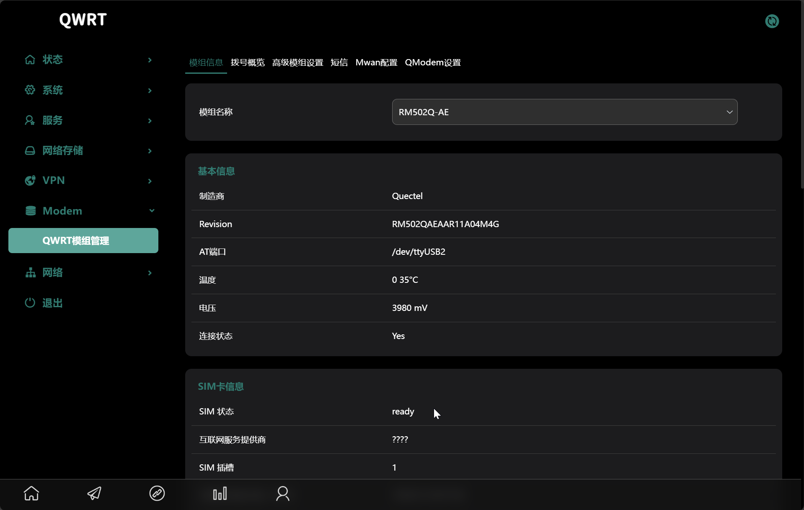
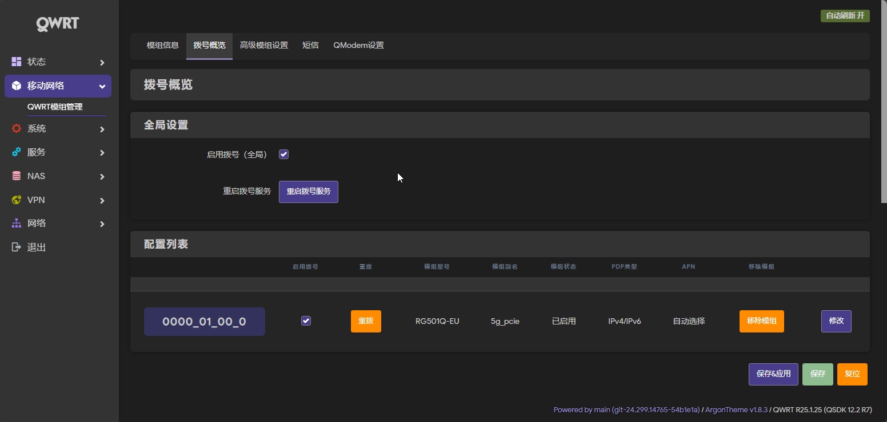
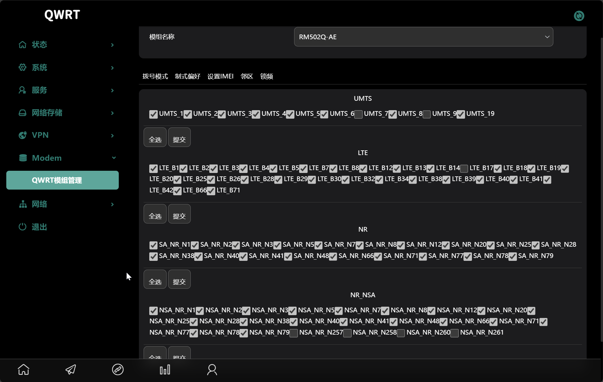
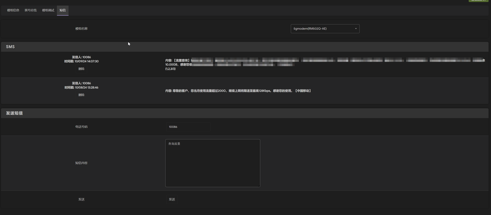
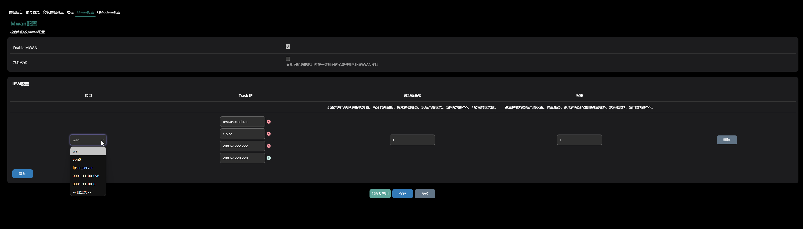

# QModem User Guide

This guide provides a comprehensive overview of the QModem package for OpenWRT, including installation, feature descriptions, detailed configuration options based on the source code, and troubleshooting steps.

## 1. Quick Start

### Compilation Method

To build QModem from the source, add the custom feed to your OpenWRT build environment:

```bash
# Add the QModem feed source
echo 'src-git modem https://github.com/sfwtw/QModem-custom.git;stw-custom' >> feeds.conf.default

# Update and install the feed packages
./scripts/feeds update modem
./scripts/feeds install -a -p modem

# (Optional) Force install to overwrite existing drivers/apps
./scripts/feeds install -a -f -p modem

# Enter the build configuration menu
make menuconfig
```

In `make menuconfig`, navigate to `LuCI -> Applications` to select the QModem packages.

Finally, build the firmware:

```bash
make -j$(nproc)
```

### Software Packages

The QModem suite is modular. Here are the functions of each package:

* **`luci-app-qmodem` (Core)**: The main package providing the core web interface for modem management, status monitoring, and dialing.
* **`luci-app-qmodem-sms`**: Adds an SMS interface to send and receive text messages.
* **`luci-app-qmodem-mwan`**: Integrates the modem with OpenWRT's `mwan3` for multi-WAN load balancing and failover.
* **`luci-app-qmodem-ttl`**: Provides options to modify the TTL of packets, which can be useful for bypassing carrier tethering restrictions.
* **`luci-app-qmodem-hc`**: Support for specific devices with hardware-controlled SIM slots (e.g., HC-G80), allowing SIM switching from the UI.

### Installation from Release

When installing pre-compiled `.ipk` packages from a release, be aware of kernel dependencies.

**Important**: Your router's kernel version must be compatible with the one used to build the packages. If you encounter errors about kernel version mismatch, you can try to force the installation, but this may lead to instability or non-functional features.

```bash
# Example installation
opkg install luci-app-qmodem.ipk

# Example of a forced installation (use with caution)
opkg install luci-app-qmodem.ipk --force-depends
```

## 2. Features Introduction

### `luci-app-qmodem` (Core)

The main plugin provides a comprehensive interface for managing your modem.

* **Modem Information**: Displays detailed status including manufacturer, model, firmware, IMEI, signal quality (RSSI, RSRP, RSRQ, SINR), and network registration details.
  
* **Dialing Control**: Allows you to configure and control the modem's data connection.
  
* **Advanced Debugging**: Offers tools for band locking, cell locking, and sending custom AT commands.
  

### `luci-app-qmodem-sms`

Adds a complete SMS portal to the LuCI interface.

* Send and receive SMS messages.
* View message history.
* Supports PDU mode for raw message sending.
  

### `luci-app-qmodem-mwan`

This plugin configures the modem as a WAN interface for `mwan3` (Multi-WAN).

* Set up load balancing rules to distribute traffic across multiple internet connections.
* Configure failover to automatically switch to a backup connection if the primary one fails.
  

### `luci-app-qmodem-ttl`

Allows you to modify the Time-To-Live (TTL) value of IP packets. This is sometimes used to prevent carriers from detecting and throttling hotspot or tethering data usage.

### `luci-app-qmodem-hc`

Provides a UI for switching between two SIM cards on specific hardware models that use GPIOs to control the active SIM slot.

## 3. Configuration Options

This section details the configuration options available within the QModem LuCI interface, as defined in the source code.

### Modem Device Configuration (`qmodem.modem-device`)

These settings are specific to each detected modem.


| Option                                           | Type      | Description                                                                                                 |
| :----------------------------------------------- | :-------- | :---------------------------------------------------------------------------------------------------------- |
| **Fixed Device** (`is_fixed_device`)             | `Flag`    | If enabled, the modem's configuration will not be updated automatically on connection/disconnection events. |
| **Slot Path** (`slot`)                           | `List`    | The physical USB or PCIe slot path the modem is connected to.                                               |
| **Interface Type** (`data_interface`)            | `List`    | The connection interface type (USB or PCIe).                                                                |
| **Alias** (`alias`)                              | `Text`    | A custom, user-friendly name for the modem.                                                                 |
| **Soft Reboot** (`soft_reboot`)                  | `Flag`    | Enables a soft reboot of the modem instead of a full power cycle.                                           |
| **V4/V6 Connect Check** (`connect_check`)        | `Flag`    | For AT-dial modems, performs a check to ensure IPv4/IPv6 connectivity is established.                       |
| **PDP Context Index** (`define_connect`)         | `Integer` | The PDP context index to use for the connection (Default: 1).                                               |
| **Manufacturer** (`manufacturer`)                | `List`    | The modem's manufacturer (e.g., Quectel, Fibocom).                                                          |
| **Platform** (`platform`)                        | `List`    | The modem's chipset platform (e.g., SDX55, SDX62).                                                          |
| **AT Port** (`at_port`)                          | `Text`    | The device path for the AT command port (e.g.,`/dev/ttyUSB2`).                                              |
| **Supported Modes** (`modes`)                    | `List`    | The network modes supported by the modem.                                                                   |
| **Enable** (`enabled`)                           | `Flag`    | Enables or disables this modem configuration.                                                               |
| **Disabled Features** (`disabled_features`)      | `List`    | Allows you to hide unsupported features (e.g., band locking, SMS) from the UI for this modem.               |
| **Band Config** (`wcdma_band`, `lte_band`, etc.) | `Text`    | Specifies the bands to use for locking (e.g., "1/3/5").                                                     |
| **Post Init / Pre Dial Delays**                  | `Integer` | Time in seconds to wait after initialization or before dialing to execute custom commands.                  |
| **Post Init / Pre Dial AT Commands**             | `List`    | A list of custom AT commands to execute at different stages of the connection process.                      |

### Dialing Configuration (`qmodem.modem-device`)

These settings control the data connection profile.


| Option                                           | Tab      | Type      | Description                                                                                                |
| :----------------------------------------------- | :------- | :-------- | :--------------------------------------------------------------------------------------------------------- |
| **Enable Dial** (`enable_dial`)                  | General  | `Flag`    | Master switch to enable or disable the dialing functionality for this modem.                               |
| **Modem Alias** (`alias`)                        | General  | `Text`    | A custom name for this dialing profile.                                                                    |
| **AT Port / SMS AT Port**                        | General  | `List`    | Selects the validated AT port for data and SMS functions.                                                  |
| **DNS** (`dns_list`)                             | General  | `List`    | A list of custom DNS servers to use. If empty, the carrier's DNS is used.                                  |
| **Bridge Mode** (`en_bridge`)                    | Advanced | `Flag`    | Enables bridge/passthrough mode. (Note: Only available for certain Quectel 5G modems).                     |
| **Do Not modify resolv.conf** (`do_not_add_dns`) | Advanced | `Flag`    | Prevents`quectel-cm` from automatically adding DNS servers to `/etc/resolv.conf`.                          |
| **RA Master** (`ra_master`)                      | Advanced | `Flag`    | If enabled, this interface becomes the IPv6 Router Advertisement master. Only one interface can be master. |
| **Extend Prefix** (`extend_prefix`)              | Advanced | `Flag`    | If enabled, the delegated IPv6 prefix will be applied to the LAN zone.                                     |
| **PDP Type** (`pdp_type`)                        | Advanced | `List`    | The IP protocol for the connection (`IPv4`, `IPv6`, or `IPv4/IPv6`).                                       |
| **APN / APN 2** (`apn`, `apn2`)                  | Advanced | `Text`    | The Access Point Name for SIM slot 1 and 2. Can be left blank for auto-detection.                          |
| **Authentication Type** (`auth`)                 | Advanced | `List`    | The authentication protocol (`NONE`, `PAP`, `CHAP`, or `PAP/CHAP`).                                        |
| **PAP/CHAP Username/Password**                   | Advanced | `Text`    | Credentials for authentication, if required.                                                               |
| **PIN Code** (`pincode`)                         | Advanced | `Text`    | The SIM card's PIN code, if it is locked.                                                                  |
| **Metric** (`metric`)                            | Advanced | `Integer` | The route metric for this interface. A lower value gives it higher priority.                               |

### MWAN Configuration (`qmodem_mwan`)


| Option                                    | Type      | Description                                                                               |
| :---------------------------------------- | :-------- | :---------------------------------------------------------------------------------------- |
| **Enable MWAN** (`enable_mwan`)           | `Flag`    | Master switch to enable or disable MWAN functionality.                                    |
| **Sticky Mode** (`sticky_mode`)           | `Flag`    | When enabled, connections from the same source IP will always use the same WAN interface. |
| **Sticky Timeout** (`sticky_timeout`)     | `Integer` | The duration in seconds to maintain a sticky connection.                                  |
| **Member Interface** (`member_interface`) | `List`    | The network interface to add to the MWAN pool.                                            |
| **Track IP** (`member_track_ip`)          | `List`    | A list of IP addresses to ping to monitor the health of the connection.                   |
| **Priority** (`member_priority`)          | `Integer` | The priority of the interface (1-255). A lower number is higher priority.                 |
| **Weight** (`member_weight`)              | `Integer` | The load balancing weight (1-255). A higher number receives more traffic.                 |

### TTL Configuration (`qmodem_ttl`)


| Option                | Type      | Description                                        |
| :-------------------- | :-------- | :------------------------------------------------- |
| **Enable** (`enable`) | `Flag`    | Enables or disables TTL modification.              |
| **TTL** (`ttl`)       | `Integer` | The TTL value to apply to packets (e.g., 64, 128). |

## 4. Troubleshooting

When you encounter issues, providing detailed logs is crucial for diagnosis. Please follow these steps to collect information before creating a GitHub Issue.

### Required Information Collection

Before creating a GitHub Issue, please collect the following information by executing the specified commands via SSH:

#### 1. Basic System Information

Provide your router model, OpenWRT version, and modem model in the issue description.

#### 2. Module Configuration

```bash
uci show qmodem
# Show module configuration
```

#### 3. Network Configuration

```bash
uci show network
# Show network configuration
```

#### 4. System Logs

```bash
logread
# View system logs
```

#### 5. Kernel Logs

```bash
dmesg
# View kernel logs
```

#### 6. USB Device Information (for USB modems only)

```bash
lsusb
# List USB devices
```

#### 7. PCIe Device Information (for PCIe modems only)

```bash
lspci
# List PCIe devices
```

#### 8. Module Scanning (if scanning issues occur)

```bash
/usr/share/qmodem/modem_scan.sh scan
# Scan modules
```

### Creating a GitHub Issue

1. Go to the [QModem GitHub Issues page](https://github.com/Fujr/QModem/issues).
2. Use the "Bug Report" template.
3. Fill in all the required sections with the information collected above.
4. Paste the command outputs into the corresponding collapsible sections in the template.
