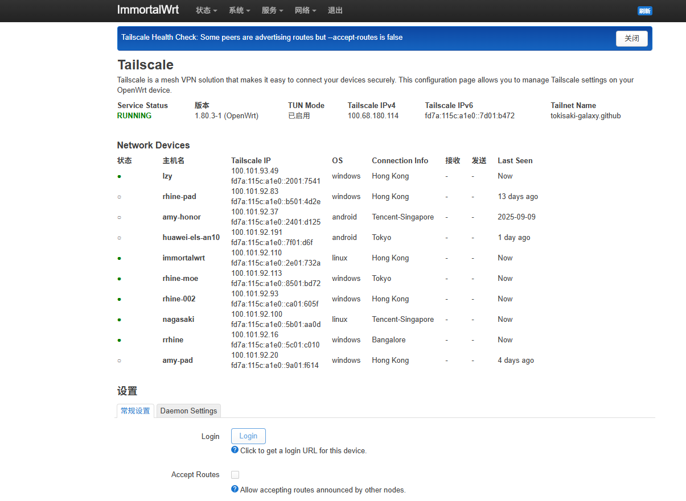
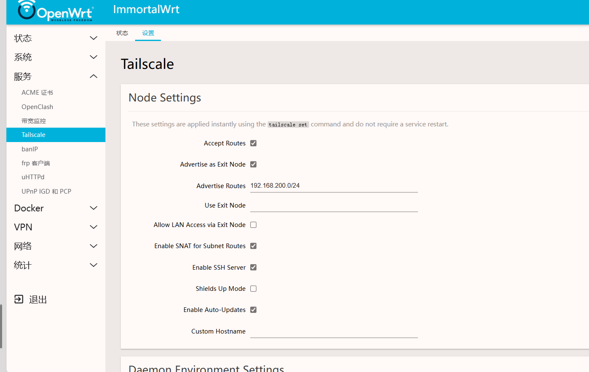

# LuCI App for Tailscale (社区版)

<p align="center">
  
  
  
</p>

<p align="center">
  <a href="https://github.com/features/actions">
    
  </a>
  <a href="https://github.com/Tokisaki-Galaxy/luci-app-tailscale-community/issues">
    
  </a>
   <a href="https://github.com/Tokisaki-Galaxy/luci-app-tailscale-community/stargazers">
    
  </a>
</p>

<p align="center">
  <a href="README.CN.md"></a>
  <a href="README.md"></a>
</p>

一个社区维护的 LuCI 应用，用于在 OpenWrt 上管理 Tailscale。此应用提供了一个友好的 Web 界面，让您可以直接从 LuCI 查看 Tailscale 状态和配置其设置。

## 功能特性

- **状态仪表盘**:
  - 查看 Tailscale 服务的运行状态。
  - 显示设备的 Tailscale IPv4 和 IPv6 地址。
  - 查看您的 Tailnet 域名。
  - 详细的网络设备（节点）列表，包括：
    - 在线/离线状态。
    - 主机名和 DNS 名称。
    - Tailscale IP 地址。
    - 操作系统。
    - 连接类型（例如，直连、中继）。
    - 离线设备的最后在线时间。

- **节点设置**:
  - 使用 `tailscale set` 命令即时应用设置，无需重启服务。
  - 切换 `接受路由`。
  - 切换 `作为出口节点`。
  - 配置 `广播路由`。
  - 设置要使用的特定 `出口节点`。
  - 在使用出口节点时切换 `允许访问 LAN`。
  - 启用/禁用子网路由的 SNAT。
  - 启用/禁用内置 SSH 服务器。
  - 切换 `Shields Up` 模式。
  - 设置自定义主机名。

- **守护进程环境设置**:
  - 为 Tailscale 守护进程配置环境变量（需要重启服务）。
  - 为有问题的网络设置自定义 MTU。
  - 为资源受限的设备启用内存优化模式。

## 界面截图

**状态页面**


**设置页面**


## 安装

### 前提条件

您的 OpenWrt 设备上必须已安装 `tailscale` 和 `ip` 软件包。

```bash
opkg update
opkg install tailscale ip
```

### 安装 LuCI 应用

1.  从 [Github Release](https://github.com/Tokisaki-Galaxy/luci-app-tailscale-community/releases) 下载最新稳定的 `.ipk` 软件包。
 - 如果有特殊需求，也可以从[GitHub Actions artifacts](https://github.com/actions) 下载最新的基于调试用途的 `.ipk` 软件包。
2.  将 `.ipk` 文件传输到您的 OpenWrt 路由器（例如，使用 `scp`）。
3.  使用 `opkg` 安装软件包：

```bash
opkg install luci-app-tailscale-community_*.ipk
```

安装后，您应该能在 LuCI 的“服务”选项卡下找到“Tailscale”菜单。

## 从源码构建

您也可以使用 OpenWrt SDK 自行构建此软件包。构建过程在 [`.github/workflows/build.yml`](.github/workflows/build.yml) 文件中定义，可作为参考。

1.  克隆 OpenWrt SDK。
2.  将此仓库克隆到 SDK 的 `package/` 目录下。
3.  运行 `make menuconfig` 并在 `LuCI` -> `Applications` 下选择 `luci-app-tailscale-community`。
4.  运行 `make` 编译软件包。

## 许可证

本项目采用 Apache 2.0 许可证。详情请参阅 [LICENSE](LICENSE) 文件。# luci-app-tailscale-community
