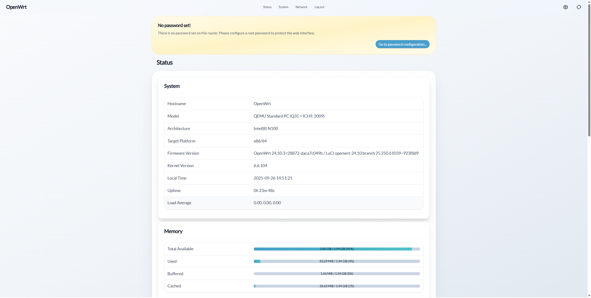
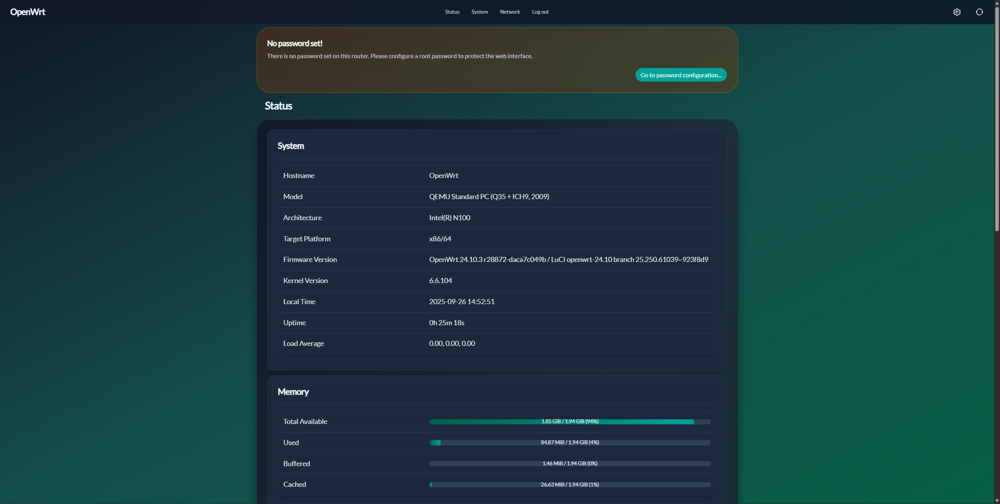
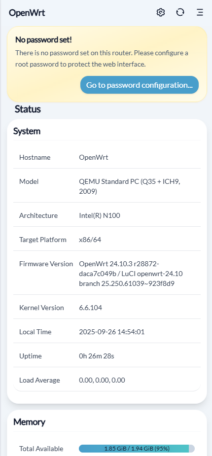

# LuCI Theme Aurora

[English](README.md) | **简体中文**

## 简介

**luci-theme-aurora** 是一款专为现代浏览器设计的 OpenWrt 主题。
主题的灵感源自 **Aurora（极光）** —— 在挪威北部特鲁姆瑟，白天映入眼帘的是洁白纯净的雪山，夜幕降临则是天际舞动的极光。
同样在主题中，我希望白天模式呈现雪山般纯净，暗夜模式展现极光般迷人。

## 兼容性

- **OpenWrt**：由于主题使用 ucode 模板，需要 **OpenWrt 22.03** 或更高版本。
- **浏览器**：主题基于 **TailwindCSS v4** 开发，请使用以下现代浏览器：
  - **Chrome/Edge 111** _(2023 年 3 月发布)_
  - **Safari 16.4** _(2023 年 3 月发布)_
  - **Firefox 128** _(2024 年 7 月发布)_

## 预览

### 桌面端

### 移动端

## 关于开发

步入 2025 年，市面上的 OpenWrt 主题开发方式仍然比较原始，而前端工具链已相当成熟且先进。  
所以全面拥抱现代前端生态，是 Aurora 主题开发的核心理念。  
Aurora 选择 Vite 作为构建工具，  
在开发阶段，可以自由选择并使用 CSS 任何工具链；  
在生产阶段，可以选择多种手段优化打包资源；  
最重要的是，通过本地代理服务器，可以做到样式修改实时预览！
